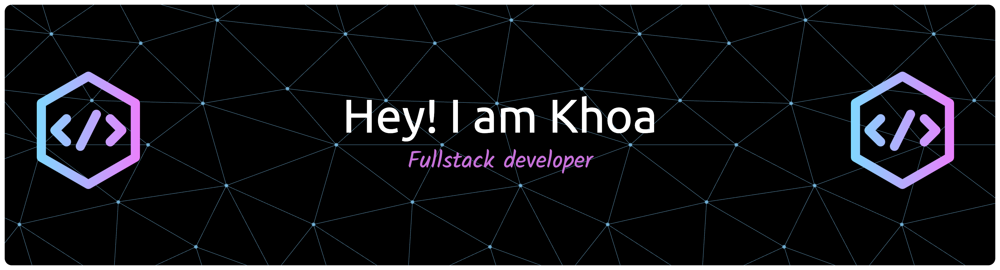

  

<h2 align="center">Fullstack Software Engineer</h2>

  Building scalable web platforms, cloud services, and AI-powered solutions

  
  
  
  
  
  

---

## 👨‍💻 About Me

I'm a **Fullstack Software Engineer** with 3+ years of experience building real-world products, from backend APIs and databases to frontend interfaces, cloud platforms, and AI-powered features.

I enjoy working on systems that require:

- Clear architecture & scalability
- Real-world constraints (concurrency, failures, consistency)
- Thoughtful trade-offs rather than just “happy-path” code

---

## 🚀 Featured Projects

### 🧪 TestArchitect Cloud — SaaS Test Automation Platform

- Migrated an on-premise automation tool into a cloud-based SaaS platform
- Implemented zero-environment setup and on-demand cloud agents
- Built real-time execution monitoring and history tracking
- Developed both backend services and frontend UI

**Tech stack:**
Spring Boot, Next.js, Docker, PostgreSQL, AWS

---

### 🤖 TestArchitect Genie — AI Assistant

- Designed an AI-powered assistant to accelerate user onboarding
- Integrated OpenAI API with prompt engineering and fine-tuning
- Provided AI-driven documentation queries and best-practice suggestions
- Built frontend (web & desktop) and backend communication layer

**Tech stack:**
Python, Java, OpenAI API, Next.js, Electron, Socket.IO

---

### 🎬 Event-driven Movie Booking System (Personal Project)

🔗 Repository: https://github.com/KhoaAnh4920/movie-booking

- Designed to simulate a real-world cinema booking workflow
- Implemented **Saga pattern** for booking–payment consistency
- Seat locking and concurrency handling for high-contention scenarios
- Message-based communication with retry and Dead Letter Queue (DLQ)
- Focused on backend architecture and system behavior under failure

**Tech stack:**
NestJS, PostgreSQL, Prisma, RabbitMQ

> This project is backend-only and serves as a system design and architectural demo.

---

## 🛠 Tech Stack

**Frontend**

- React, Next.js, HTML, CSS

**Backend**

- Java (Spring Boot), Node.js (NestJS), Python

**Database**

- PostgreSQL, MySQL, MongoDB

**Cloud & DevOps**

- Docker, AWS

**AI**

- OpenAI API, NLP, prompt engineering

---

## 📚 Currently Exploring

- Distributed systems & system design
- Observability and reliability patterns
- Scalable backend architectures

---

## 📫 Contact

- GitHub: https://github.com/KhoaAnh4920
- LinkedIn: https://www.linkedin.com/in/khoaanh4920/
- Email: khoaanh4920@gmail.com
